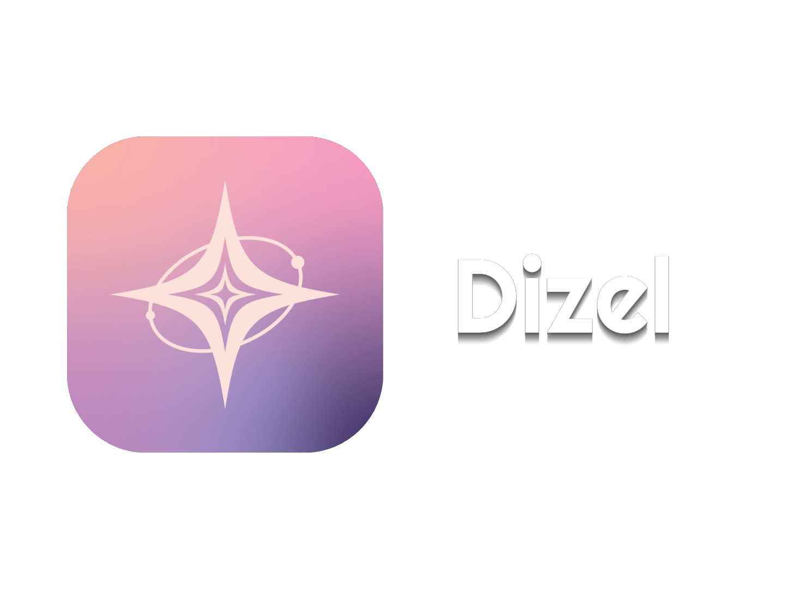

<div align="center">
  
  <h1>Dizel — Distributed Intelligent Zero-shot Execution Layer</h1>
  <p>
    A Tiny GPT-Style Language Model From Scratch.
  </p>
</div>

Dizel is a complete, educational implementation of a GPT-style causal language
model (~253 M parameters) built with PyTorch. It is designed to run locally on a
single consumer GPU (~4 GB VRAM) over a weekend, with no distributed training
required.

---

## What You Will Build

| Component | Details |
|---|---|
| **Architecture** | Causal Transformer (Pre-LayerNorm, GELU MLP, multi-head self-attention) |
| **Parameters** | ~110 M (configurable 10–250 M) |
| **Tokenizer** | SentencePiece BPE, 8 000 vocab |
| **Pre-training** | Next-token prediction, cosine LR, AMP, gradient accumulation |
| **SFT** | Basic chat format, prompt-loss masking |
| **Inference (CLI)** | CLI chat with streaming, top-k/nucleus sampling, repetition penalty |
| **Inference (GUI)** | Full Desktop App (CustomTkinter) with dark theme, history, and persistent settings |

---

## Folder Structure

```text
dizel/
├── config.py                    ← All hyperparameters in one place
├── requirements.txt             ← All app requirements and optionals too
│
├── data/
│   └── english.md               ← Training corpus (plain English text)
│
├── tokenizer/
│   ├── train_tokenizer.py       ← Train SentencePiece BPE tokenizer
│   ├── corpus.txt               ← (generated) plain texts
│   ├── dizel.model              ← (generated) tokenizer model
│   └── dizel.vocab              ← (generated) vocabulary
│
├── model/
│   ├── __init__.py              ← Null (Package loader)
│   ├── dizel_info.py            ← Model full specs and info
│   └── architecture.py          ← DizelLM: full Transformer implementation
│
├── core/
│   ├── agents/                  ← Content Dict and Lily agents config
│   ├── tools/                   ← Tools and functions of Dict and Lily
│   ├── __init__.py              ← Null (Package loader)
│   ├── prompt_builder.py        ← Format agent results into clean text context for Dizel
│   └── router.py                ← Detect input type and dispatch to the correct agent
│
├── training/
│   ├── __init__.py              ← Null (Package loader)
│   ├── dataset.py               ← PretrainDataset, SFTDataset, Tokenizer wrapper
│   ├── pretrain.py              ← Pre-training loop (AMP, grad accum, LR schedule)
│   └── sft.py                   ← Supervised fine-tuning for chat format
│
├── sft_data/
│   ├── generate_sft_data.py     ← Generate synthetic chat JSONL data
│   └── chat.jsonl               ← (generated) ~60 conversation examples
│
├── inference/
│   ├── cli_ui
│   │   └── cmd_ui.py            ← CLI chat / completion / JSON inference
│   │
│   └── dizel_ui/                ← Full Desktop GUI Application!
│       ├── main.py              ← Run this to start the desktop app
│       ├── __init__.py          ← Null (Package loader)
│       ├── theme/               ← Theme manager and logic
│       ├── history/             ← Saved chats via JSON    (auto-created)
│       ├── .dizel/              ← Saved settings via JSON (auto-created)
│       ├── ui/                  ← PySide6 UI components
│       ├── utils                ← Icons loader and Dict and Lily logic
│       ├── logic/               ← Async generation and config/history managers
│       └── assets/              ← Logo and avatar images
│       
├── utils/
│   ├── __init__.py              ← Null (Package loader)
│   ├── data_cleaner.py          ← Clean the training data
│   ├── test_model.py            ← Test the model
│   └── verify.py                ← Sanity checks (no GPU required)
│
├── checkpoints/                 ← Saved model checkpoints (auto-created)
└── logs/                        ← Training loss CSV logs  (auto-created)
```

---

## Setup

### 1. Install dependencies

```bash
# Create a virtual environment (recommended)
python -m venv .venv
source .venv/bin/activate      # Windows: .venv\Scripts\activate

# Install PyTorch with CUDA (replace cu121 with your CUDA version)
pip install torch --index-url https://download.pytorch.org/whl/cu121

# Install remaining dependencies
pip install -r requirements.txt
```

### 2. Verify your installation

```bash
python -c "import torch; print(torch.cuda.is_available(), torch.version.cuda)"
# Should print: True  12.x
```

---

## Execution Steps

### Step 0 — Quick Start (If you already have a checkpoint)

If you have downloaded a pre-trained Dizel checkpoint (e.g. `dizel-sft-best.pt`), you can skip the training steps and immediately launch the graphical Desktop Interface to chat with it.

*(Or if there was a `dizel-sft-best.pt` in the `checkpoints` folder in the project directory, you can just use that file.)*

1. Install the dependencies (see Setup above).
2. Launch the Desktop App:
   ```bash
   python inference/dizel_ui/main.py
   ```
3. Click the **⚙ Configuration** button in the UI.
4. Use the **Checkpoint Loader** to select your `.pt` file.
5. Click **Back**/**Save** — the model will load in the background, and you're ready to chat!

*If you do not have a checkpoint and want to build the model from scratch, continue with Step 1 below.*

---

### Step 1 — Review and tune configuration (optional)

Open `config.py`. Key parameters:

```python
# Model size
d_model  = 384          # hidden dimension  (256 = smaller/faster, 512 = larger/slower)
n_layers = 6            # transformer depth
n_heads  = 6            # attention heads   (d_model must be divisible by n_heads)

# Training
batch_size  = 8         # micro-batch per step
grad_accum  = 8         # effective batch = 8 × 8 = 64 sequences
max_steps   = 4000      # how many steps the pretrain and sft does
lr          = 3e-4      # how much the model will learn with the training
context_length = 512    # how much contexts for the model to generate a respond
```

**Estimated parameters** by `d_model`:

| d_model | n_layers | Parameters |
|---------|----------|------------|
| 256     | 6        | ~10 M      |
| 384     | 6        | ~20 M      |
| 512     | 6        | ~34 M      |
| 2048    | 12       | ~110.35 M  |

---

### Step 2 — Add training data

The file `data/english.md` ships with ~5 000 words of seed text. For better
results, **add more plain English text** to the same file:

- Wikipedia article extracts (plain text dump)
- Project Gutenberg books
- Any well-written English prose
- HuggingFace dataset samples
- etc...

The more diverse the data, the better. Even 1–5 MB of text makes a noticeable
difference.

---

### Step 3 — Train the tokenizer

```bash
python tokenizer/train_tokenizer.py
```

This reads `data/english.md`, trains a BPE SentencePiece model with 8 000
vocabulary entries, and writes `tokenizer/dizel.model` and `tokenizer/dizel.vocab`.

**Output:**

```text
[tokenizer] Wrote plain text to tokenizer/corpus.txt (45,123 chars)
[tokenizer] Training SentencePiece BPE (vocab=8,000) ...
[tokenizer] Trained BPE model → tokenizer/dizel.model
[tokenizer] Round-trip OK ✓
```

---

### Step 4 — Run sanity checks

```bash
python utils/verify.py
```

Verifies model architecture, forward pass, loss at initialisation, generation
shape, and tokenizer round-trip. **No GPU required.** Should complete in < 5 s.

---

### Step 5 — Pre-train Dizel

```bash
python training/pretrain.py
```

With optional overrides:
```bash
python training/pretrain.py --max_steps 6000 --lr 5e-4 --d_model 256
```

**What to expect:**


| Step | Train Loss | Notes |
|------|------------|-------|
| 0    | ~9.0       | Random initialisation (~ln(8000)) |
| 200  | ~5.0–6.0   | Starting to learn common words |
| 1000 | ~3.5–4.5   | Coherent word sequences |
| 4000 | ~2.5–3.5   | Reasonable sentences on training data |

A good val loss for this corpus size is **≤ 3.0**. The model will overfit on
tiny data — the dropout, weight decay, and window reshuffling all help mitigate
this.

Checkpoints are saved to `checkpoints/`:
- `dizel-pretrain-best.pt`     — best val loss
- `dizel-pretrain-step{N}.pt`  — periodic saves
- `dizel-pretrain-final.pt`    — end of training

Resume training from a checkpoint:
```bash
# 1st Option
python training/pretrain.py --resume checkpoints/dizel-pretrain-step{N}.pt

# 2nd Option (Recommended)
python training/pretrain.py --resume checkpoints/dizel-pretrain-best.pt
```

**Approximate training time (RTX 3060, 12 GB VRAM):**
- 4 000 steps, d_model=384, ctx=512: ~1.5–2 hours
- 4 000 steps, d_model=256, ctx=512: ~45–60 minutes

---

### Step 6 — Generate SFT training data

```bash
python sft_data/generate_sft_data.py
```

Creates `sft_data/chat.jsonl` with ~60 synthetic Q&A pairs in the chat format:
```json
{
  "messages": [
    {"role": "system",    "content": "You are Dizel..."},
    {"role": "user",      "content": "What is photosynthesis?"},
    {"role": "assistant", "content": "Photosynthesis is the process..."}
  ]
}
```

*You can add your own examples to this file in the same format.*

---

### Step 7 — Supervised fine-tuning (SFT)

```bash
python training/sft.py --base_checkpoint checkpoints/dizel-pretrain-best.pt
```

SFT runs for 500 steps (default) at a lower learning rate (1e-4). It:
- Loads the pretrained weights
- Teaches the model the `<|user|>` / `<|assistant|>` conversation format
- Computes loss **only on assistant tokens** (prompt masking)

Output checkpoint:
- `checkpoints/dizel-sft-step{N}.pt`
- `checkpoints/dizel-sft-best.pt`

Resume sft from a checkpoint:
```bash
# 1st Option
python training/pretrain.py --resume checkpoints/dizel-sft-step{N}.pt

# 2nd Option (Recommended)
python training/pretrain.py --resume checkpoints/dizel-sft-best.pt
```

---

### Step 8 — Chat with Dizel

**Interactive chat:**
```bash
python inference/cli_ui/cmd_ui.py --checkpoint checkpoints/dizel-sft-best.pt
```

**Raw text completion (pretrain checkpoint):**
```bash
python inference/cli_ui/cmd_ui.py \
    --checkpoint checkpoints/dizel-pretrain-best.pt \
    --mode complete \
    --prompt "Photosynthesis is the process by which"
```

**JSON structured output:**
```bash
python inference/cli_ui/cmd_ui.py \
    --checkpoint checkpoints/dizel-sft-best.pt \
    --mode json \
    --prompt "List the planets in the solar system"
```

**Sampling controls:**
```bash
python inference/cli_ui/cmd_ui.py \
    --checkpoint checkpoints/dizel-sft-best.pt \
    --temperature 0.7 \
    --top_k 40 \
    --top_p 0.9 \
    --repetition_penalty 1.2
```

**In-chat commands:**

```text
/quit          Exit
/new           Clear conversation history
/system <text> Change the system prompt
/info          Show model info and settings
/temp 0.6      Adjust temperature on the fly
```

---

### Step 9 — Launch the Desktop UI *(Recommended)*

Dizel includes a fully localized, premium Desktop Interface built with PySide6 featuring the **Premium Dark Theme**. 

```bash
python inference/dizel_ui/main.py
```

**(Optional)** Pass a checkpoint right from the command line:
```bash
python inference/dizel_ui/main.py --checkpoint checkpoints/dizel-sft-best.pt --device cuda | cpu
```

**Features of the Desktop App:**
- **Persistent Settings:** Your temperature, top-p, checkpoints, and UI preferences are saved automatically bridging sessions.
- **Chat History:** Seamlessly manage multiple conversations from the left sidebar.
- **Attachment Previews:** Visually queue up reference items for your prompts.
- **Model Switcher:** Switch from Dizel and Mila model versions.
- **Context Chips:** The model `Web Search`, `Deep Think` and `Parse Files` modes.
- **Hardware Info:** Live UI tracking of Generation Tokens/sec and Context windows.
- **KeyBoard Shortcut:** `CTRL+K` with open the shortcut for alot of options.
- **Contexts Limiter:** Live UI tracking of context limits.
- **Dark/Light Themes:** Premium colors for Dark and Light mode 
  *(WARNING! Light mode can cause a flashbang when switch from Dark mode, so please be careful)*.

---

## Weekend Timeline

| Time Block | Task |
|------------|------|
| **Fri evening** | Install PyTorch + CUDA, run `verify.py`, read `architecture.py` |
| **Sat morning** | Train tokenizer, start pre-training (let it run) |
| **Sat afternoon** | Read training logs, generate SFT data, run SFT |
| **Sat evening** | Chat with the model, tune sampling parameters |
| **Sun morning** | Add more training data, retrain with better hyperparameters |
| **Sun afternoon** | Experiment: change d_model, n_layers, context_length |
| **Sun evening** | Write your own SFT examples, fine-tune again, celebrate |

---

## Architecture Deep-Dive

### Causal Self-Attention

```text
input x (B, T, d_model)
   │
   ├─ QKV = Linear(d_model → 3 × d_model)
   │       split into Q, K, V
   │
   ├─ reshape to (B, n_heads, T, head_dim)
   │
   ├─ attn = softmax(Q @ K.T / √head_dim + causal_mask)
   │        (Flash Attention via PyTorch 2.x SDPA if available)
   │
   └─ output = attn @ V  →  reshape  →  Linear(d_model → d_model)
```

### Transformer Block (Pre-LayerNorm)

```text
x → LayerNorm → Attention → + → LayerNorm → MLP → +
│                            ↑                     ↑
└────────────────────────────┘─────────────────────┘
         residual connections (help gradient flow)
```

### Why Pre-LayerNorm?

Post-LN (LayerNorm after residuals) is the original Transformer design but
requires careful learning rate warm-up to train stably. Pre-LN (before each
sub-layer) is more stable with standard AdamW and no special tricks.

### Weight Tying

The token embedding matrix (vocab × d_model) and the LM head (d_model × vocab)
share the same weights. This reduces parameters by ~3 M and often improves
perplexity because the model learns that words close in embedding space
should have similar output distributions.

---

## Overfitting on Small Data

Small corpora are the primary challenge. Dizel uses several mitigations:

| Technique | Where | Effect |
|---|---|---|
| **Dropout (0.15)** | Attention + MLP | Prevents memorisation |
| **Weight decay (0.1)** | AdamW | L2 regularisation |
| **Window reshuffling** | DataLoader | Breaks repetitive mini-batch patterns |
| **Overlapping windows (stride = ctx/2)** | PretrainDataset | More training examples |
| **Gradient clipping (1.0)** | Optimiser | Prevents instability |
| **Learning rate schedule** | Cosine + warmup | Stable convergence |
| **Weight tying** | Embeddings/LM head | Parameter efficiency |

> If val loss stops decreasing early, try:
1. Adding more training data (most effective)
2. Increasing dropout to 0.2–0.3
3. Reducing model size (smaller d_model)
4. Increasing weight decay

---

## VRAM Usage Guide

| Config | d_model | Batch × Accum | VRAM (bfloat16) |
|--------|---------|---------------|-----------------|
| Tiny   | 256     | 4 × 8         | ~1.5 GB         |
| Small  | 384     | 8 × 8         | ~2.5 GB         |
| Medium | 512     | 8 × 8         | ~4.0 GB         |
| Large  | 768     | 4 × 8         | ~6.0 GB         |

If you get OOM errors: reduce `batch_size`, reduce `context_length`, or
enable gradient checkpointing (add `use_reentrant=False` to `torch.utils.checkpoint`).

---

## Extending Dizel

### Add more data
Append any `.md` or `.txt` text to `data/english.md` and retrain the tokenizer.

### Change model size
Edit `d_model`, `n_layers`, `n_heads` in `config.py`.  
Remember: `d_model` must be divisible by `n_heads`.

### Add more SFT examples
Edit `sft_data/generate_sft_data.py` or append lines to `sft_data/chat.jsonl`.

### Export to ONNX
```python
import torch
from model.architecture import DizelLM
model = DizelLM(cfg)
dummy = torch.zeros(1, 64, dtype=torch.long)
torch.onnx.export(model, dummy, "dizel.onnx", opset_version=17)
```

---

## Frequently Asked Questions

**Q: Why does the model repeat itself?**  
> Increase `repetition_penalty` (try 1.2–1.5) or reduce `temperature`.

**Q: Why is the output nonsensical?**  
> The model may not have trained long enough. Check that val loss is ≤ 3.5. Add more data. The more dataset it gets, the more it'll respond with less nonsensial texts.

**Q: Can I run this on CPU?**  
> Yes — set `device = "cpu"`. Training will be ~50× slower. Inference is fine for short generations.

**Q: How do I use my own text?**  
> Replace or append to `data/english.md`, re-run `train_tokenizer.py`, then retrain.

**Q: How do I make the model produce better JSON?**  
> Add more JSON examples to `sft_data/chat.jsonl` and re-run SFT. Lower temperature to 0.2–0.4.

**Q: Is the model free-to-use?**  
> Yes, it is! — As if right now, this model has the MIT license, things may change in the future.

**Q: How can i report any errors/issues?**  
> Very simple! — Just go to the model Github Res and create an *Issue* request.

---

## References

- **Attention Is All You Need** — Vaswani et al., 2017
- **GPT-2** — Radford et al., 2019 (OpenAI)
- **nanoGPT** — Andrej Karpathy (architectural inspiration)
- **SentencePiece** — Kudo & Richardson, 2018
- **PyTorch Documentation** — pytorch.org
